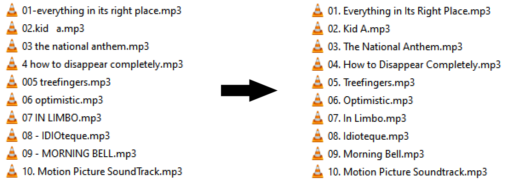

# Music File Corrector

An experiment in automating the reformatting of music filenames.
It presently assumes that the original filenames only contain a number
(corresponding to the track number) and the title itself.

Takes two arguments:

1. The filepath leading to the folder containing the music files
2. (optional). **-w**: changes each filename to the corrected name
in addition to writing the corrected names in an output document.

### Example

The following image illustrates the current capabilities of the project.
It's able to separate the track number and words, and reformat them to fit 
the template of "XX. (track title)":

## Considered Features

- Accurately verifying the number of tracks, and consequently the number of zeroes required for each track number
- Different formatting parameters based on structure
  - Example: Instead of "XX. (track title)", there can be "XX - (track title)"
- Different formatting parameters based on language
  - Example: in French, words in a song are all in minuscule save for the first word and any proper nouns
- Linux support (replace back slash with forward slash when looking for the filename in folder path)
